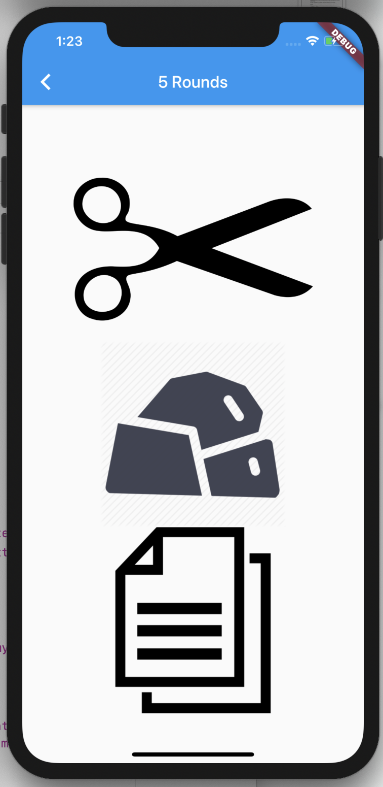

# 20TImeRPS
Rock paper scissors AI

## Instructions:

Step 1: Download Visual Studio code (You could probably use another IDE, but I know for sure that this one works) Here: https://code.visualstudio.com/download

Step 2: Download XCode, Choose version here: https://developer.apple.com/xcode/resources/
    (I believe I used the newest non-beta version)

Step 3: Download the IOS simulator by going into Xcode, then clicking "Xcode" up in the upper left corner by the apple symbol then Preferences > Components and the download should be right there, I used the ios 13.2 simulator (see picture below for example)

Step 4: Download Flutter here: https://flutter.dev/docs/get-started/install

Step 5: Open up the simulator by going to your computer's search bar and typing "simulator" (see 2nd image below)
    let it load

Step 6: clone the code from the github into your Visual Studio code, and go to the terminal inside of VSC (if you dont have one, then click the "terminal button" on the top bar that contains things like "File" and "Edit" then click new Terminal) then make sure you are in the rps_interface folder (if not cd into it in the terminal) then type "flutter run" and wait. 

Step 7: After the app has loaded you should be good to go, it normally takes around 30 seconds or less (to load) depending on how many tabs you have open

## Screenshots of Successful Run

## File Purposes

#### The .png files directly in 20TimeRPS
    Used in this README as screenshots of successful runs

#### rps_Interface 
    Contains all code within inner folders and files
    
#### Flutter sdk folders 
    ie. android, build, ios, pubspec.lock, pubspec.yaml, README.md, test
    All of these folders and files are used in (and make up) the flutter api, therefore I have basically no idea what they do other than what can be implied from their name and description. 
    
#### lib
    Contains all of the image assets and the main dart file used in my project, this contains basically everything I created
    
#### Main.dart
    This is the file where all of the dart code is written which creates the application and calculates the odds of the approriate moves to make in the rps game
    
#### Assests and Images folders
    These contain all of the images I either used or was thinking about using throughout my project. There are quite a few unused photos, this is because I initially found jpgs and later realized that pngs worked better for the interface look.

## ToDo/Unimplemented Features
#### Clean up Code
    I coded this while learning how to use flutter and dart, thus the code is pretty messy and excessive. If given enough time, I believe I could cut the number of lines down by nearly half and make it much more readable.

#### Markov chain/ added more advanced AI
    In its current state the AI that calculates the computer move, while decent, still can be greatly improved upon. If I have additional time, the addition of a Markov chain to store user patterns in moves could be quite useful. For that matter, the data is reset each time a new round starts, so being able to store and access data from past rounds would also be quite useful. 

